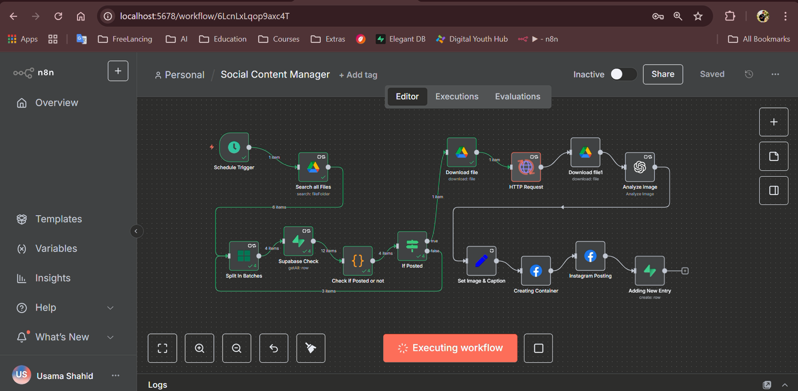
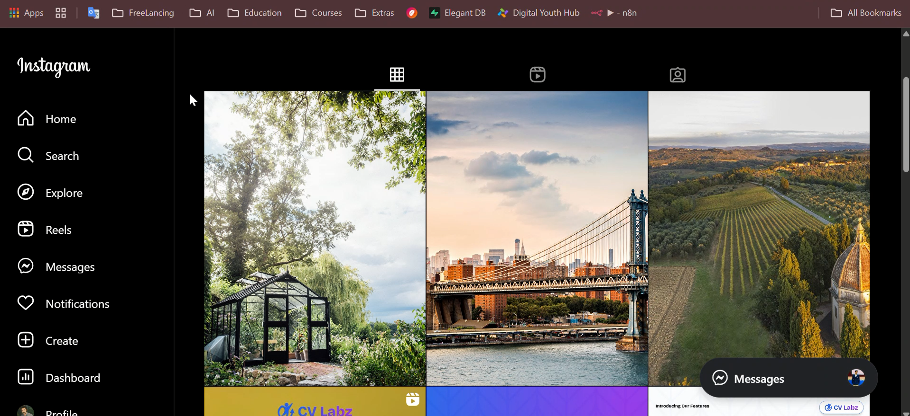

# 📱 SocialContentEngine - n8n Social Media Auto-Poster

> Automates posting images from a Google Drive folder: searches Drive, skips already-posted files (records kept in Supabase), uploads new images to a Supabase storage bucket (public URL), generates captions via OpenAI, creates Instagram media containers and publishes them via the Facebook Graph API, and records posted images in Supabase.

---

## 🎥 Workflow Demo

### 🔹 Workflow Preview (Image)



<!-- ### 🔹 Workflow Demo (Video)

📺 *(Add your Loom / YouTube demo link here)*
[▶ Watch Demo Video](https://youtu.be/your-demo-video-link)
-->
---

## 📌 Project Summary

SocialContentEngine is an **automation workflow built in n8n** that connects Google Drive, Supabase, OpenAI, and the Instagram Graph API to streamline social content publishing.

It checks Google Drive for new files, avoids duplicates via Supabase, uploads valid images to a Supabase bucket, generates captions with OpenAI, and posts them to Instagram automatically. Posted entries are logged back in Supabase for record-keeping.

---

## ⚙️ Features

* 📂 **Google Drive Integration** – fetch new images from a specific folder
* 🛢 **Supabase Database** – check if files are already posted & record posted ones
* ☁ **Supabase Storage** – store images & generate public URLs
* ✍ **AI Captions** – generate creative captions/hashtags with OpenAI
* 📸 **Instagram Auto-Posting** – publish to Instagram Business/Creator accounts
* 🔄 **Fully Automated** – once set, everything runs on schedule

---

## 🧰 Tech Stack

| Component          | Tool / Service                 |
| ------------------ | ------------------------------ |
| Automation Engine  | [n8n](https://n8n.io)          |
| File Source        | Google Drive                   |
| Database & Storage | Supabase (Postgres + S3)       |
| AI Captioning      | OpenAI API                     |
| Social Posting     | Facebook Graph API (Instagram) |

---

## 🗂 Folder Structure

```bash
SocialContentEngine/
├── images/                     # Screenshots (flow diagram, outputs, etc.)
├── Social Media Post.json       # n8n workflow export
└── README.md
```

---

## ✅ Prerequisites

* Running **n8n** instance (self-hosted or cloud)
* **Google Drive API** enabled with OAuth2 credentials
* **Supabase** project with:

  * Public storage bucket (`insta_uploads`)
  * Database table (`my_table`) to track posted files
* **Facebook Developer App** + Page + Instagram Business/Creator account
* **OpenAI API key**

---

## 🔐 Credentials Setup

You’ll need to configure credentials in n8n for:

1. **Google Drive OAuth2** – connect Drive and provide Folder ID.
2. **Supabase** – project URL + service role key.
3. **OpenAI** – API key for GPT caption generation.
4. **Facebook Graph API** – Page access token with `instagram_content_publish` permission and your Instagram business account ID.

---

## ⚙️ Step-by-Step Setup

### 1) Google Drive

* Enable Google Drive API in Google Cloud.
* Create OAuth2 credentials → add redirect URI for n8n (`/rest/oauth2-credential/callback/googleDriveOAuth2Api`).
* In workflow, replace folder ID in:

  ```
  'YOUR_FOLDER_ID' in parents and mimeType contains 'image/'
  ```

---

### 2) Supabase

* Create **storage bucket**: `insta_uploads` (public).
* Create **table**:

  ```sql
  create table public.my_table (
    id text primary key,
    name text not null,
    created_at timestamptz default now()
  );
  ```
* Update workflow’s Supabase nodes (`Supabase Check`, `Adding New Entry`, and HTTP upload node).
* Use endpoint format:

  ```
  POST https://<PROJECT_REF>.supabase.co/storage/v1/object/insta_uploads/{filename}
  ```
* Public URL:

  ```
  https://<PROJECT_REF>.supabase.co/storage/v1/object/public/insta_uploads/{filename}
  ```

---

### 3) OpenAI

* Get API key from [OpenAI](https://platform.openai.com).
* Configure **OpenAI node** in n8n → model `gpt-4o-mini`.
* Pass image binary as input to generate captions/hashtags.

---

### 4) Instagram / Facebook Graph API

* Create a Facebook App.
* Link a Page and Instagram Business/Creator account.
* Generate Page access token with `instagram_content_publish`.
* Get Instagram Business ID:

  ```
  GET /{page-id}?fields=instagram_business_account
  ```
* Use that ID as `node` in workflow’s Instagram nodes.

---

## 🚀 Running the Workflow

1. Import `Social Media Post.json` into n8n.
2. Configure all credentials.
3. Test node-by-node (Google Drive → Supabase → Upload → OpenAI → Instagram).
4. Activate workflow & schedule runs.
5. New Drive images will now be auto-posted to Instagram with AI captions.

---

## 📷 Example Output

| Workflow Flow        | Instagram Post Example       |
| -------------------- | ---------------------------- |
|  |  |

---

## 🤝 Contact & Support

For any help, queries, or collaborations, reach out:

👤 **Usama Shahid**

📧 Email: [dev.usamashahid@gmail.com](mailto:dev.usamashahid@gmail.com)

🔗 LinkedIn: [linkedin.com/in/-usamashahid](https://linkedin.com/in/-usamashahid)

🐙 GitHub: [github.com/fewgets](https://github.com/fewgets)

---

## 📜 License

This project is for learning & research purposes. Feel free to fork, adapt, and improve.
